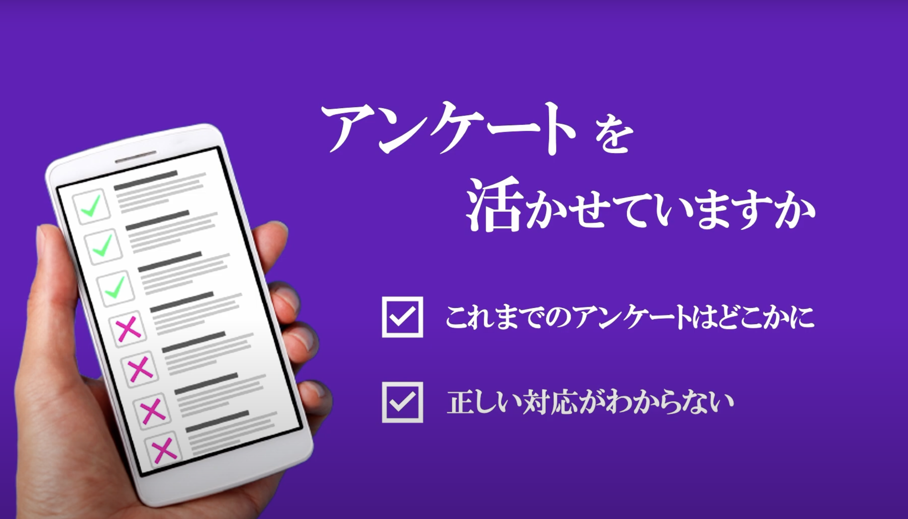

### やったこと
Sormというウェブアプリを株式会社エミシス様と共同で開発．youtubeで[動画](https://youtu.be/-W3E32ZvE_M?si=JZ95PKE0OPL0tKRU&t=2771)が公開されているため，実施内容や作成プロダクトの詳細が確認可能

#### 概要
Google Formと連携し，高次元データを解析し，マップで可視化するプロダクト
#### 課題
アンケートなどによってデータを収集しても管理・分析まで出来ていない．

#### 解決方法
Google Form apiから取得したアンケートをアプリ上でまとめて管理し，機械学習技術である自己組織化マップ (SOM) によって分析し，高次元データを可視化

#### アプリ詳細
アプリの登録画面

生データ(左)とそれをSOMによってマップ表現に可視化した (右) 図

##### マップについて
マップには2つのモードが存在する．
1. U-matrix 
似ている度合いを色で表現．マップ上で青で表現されてかつ近い場所にいる2人のエンジニアは近い能力を持っている事を示している．

2. Component Plane
特定の技術スタックについて得意な人を赤で表示し，苦手な人を青で表示．

##### 生データの確認方法について
マップ上の各マスや該当する人物はクリックする事で，右に生データを表す棒グラフが表示されル．
### コードについて
共同開発であるため非公開